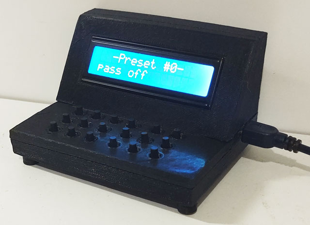

# P1K2I's Password Keyboard

This custom USB keyboard, built using Arduino and 3D-printed parts, generates passwords on demand. Rather than storing passwords, it uses seeds and a unique key to create the same password each time, ensuring security without a password vault. I’ve also included a master password to lock the device and added a few convenient presets.

The software installs on a **Pro Micro ATmega32U4**. It connects as a USB keyboard without requiring special drivers. The top panel has 10 numeric buttons, 4 for switching between presets, 1 for opening and iterating settings, 1 for generating a random password, and 2 for confirm and cancel actions. A reset button on the bottom instantly erases all data and restores default settings.

To use a preset, you first specify a unique numeric seed. This seed generates passwords, and entering the same numeric code on the preset’s main page will always yield the same password. You can also choose a symbol table (Numeric, Basic, Advanced) and specify a password length (up to 512 characters).

Four presets can be saved in encrypted EEPROM storage, while preset #0 is stored in RAM. Each preset can be protected by a numeric master password, which encrypts all data using that master password. A hash of this password, stored in EEPROM, authenticates the user at login.

Your important data (seed, password length, symbol table name) remains encrypted if the master password is enabled. This means the only way to retrieve information like the seed is by brute-forcing the master password hash, so avoid setting short or obvious passwords!

Finally, note that passwords are generated using more than just the seed alone; an attacker would also need specific codes to combine with the seed. Here are my recommendations for setting up a secure preset:

1) Use a strong master password – Ensure your master password is at least 8 characters long (up to 128 characters for added security). Avoid easily guessed words or patterns to enhance protection.
2) Set longer codes – For optimal security, use codes with 4 to 6 digits or more, up to 128 digits. This makes brute-force attempts significantly harder and strengthens each password generation.
3) Enable "Autolock" – Activate the autolock feature to automatically exit a preset after 30 seconds of inactivity and immediately after each password generation. This adds a layer of security by preventing unauthorized access during idle times.

By following these guidelines, your custom USB keyboard can serve as a highly secure, on-demand password generator, minimizing the need for external password storage.

Examples:

seed (base 10) | code | password numeric | password basic | password advanced
--- | --- | --- | --- | ---
111 | 0 | 049549805917 | 4bwiBkdjgmic | bF<ljng/jQl(
123 | 0 | 662921249621 | vz8WVg6xU2L1 | ;?f`@,E=^"U_
123 | 00 | 662921249621 | vz8WVg6xU2L1 | ;?f`@,E=^"U_
123 | 1 | 217609576606 | VMyRT7w9xRRv | _V][]'zH=z[Z
123 | 10 | 972759792100 | qe85yo1ELGdt | UhGc>r@NUogw
123 | 01 | 398377023851 |  Ygzs112r7F71 | b,}v_!"8Fne_
